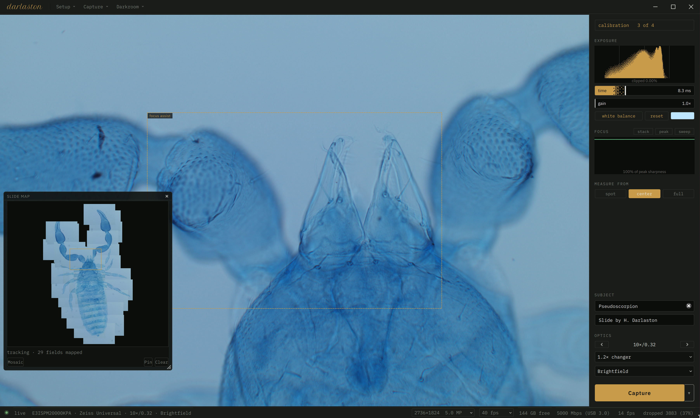

  

Originally built for photographing diatom arrangements, _*darlaston*_ is a tool for creative microscopy. It provides a convenient workflow for focus stacking, mosaic stitching, and more, while never compromising on quality. Free to use and share, it's designed to help you capture beautiful images and share your love for the microscopic world.

Named for **Herbert William Hutton Darlaston** (1867-1949), who prepared nearly a thousand microscope slides in his first year at the bench only to give most of them away. He continued his work for the next fifty years under the promise _Every Slide Perfect_.

## Features

  

_*darlaston*_ is compatible with most USB microscope cameras (Toup-family and generic) and offers a full suite of photomicrography utilities:

- **12-bit RAW** - the only photomicrography tool that gives you RAW photos with extended dynamic range for postprocessing in Lightroom, Darktable or other apps.
- **Comprehensive EXIF** - optics tagging ensures your work is properly documented, including subject metadata and author copyrights.
- **Stage mapping** - tracks your movements and builds a live minimap of your slide to help you plan captures.
- **Mosaic stitching** - to capture super high resolution images larger than your field of view.
- **Focus stacking** - with an easy workflow that detects focus changes and takes shots automatically.
- **Focus stacked mosaics** - combine both focus stacking and mosaic stitching in a single pass, seamlessly.
- **Focus and exposure assist** - sharpness tracking and a detailed histogram help you capture the best shots possible.
- **Timelapses** - see how your specimen changes over time.
- **Scale bars** - calculate the size of your specimens based on your current optical setup.
- **Creative depthworks** - turn your focus stacks into into wigglegrams, focus pulls, turntables, stereo pairs, red/cyan anaglyphs, autostereograms, printable meshes, and more.

### Compared to Other Tools

|                  | _*darlaston*_          | ToupView | Helicon         | Zerene                 |
| ---------------- | ---------------------- | -------- | --------------- | ---------------------- |
| Runs On          | Mac OS, Windows, Linux | Windows  | Mac OS, Windows | Mac OS, Windows, Linux |
| Cost             | Free                   | Free     | $200            | $89 to $289            |
| Mosaic Stitching | Yes                    | Yes      | Yes             | No                     |
| Focus Stacking   | Yes                    | Yes      | Yes             | Yes                    |
| Stack + Stitch   | Yes                    | No       | No              | No                     |
| RAW Output       | Yes                    | No       | Yes (plugins)   | No                     |
| Camera Control   | Yes                    | Yes      | Yes (+$75)      | No                     |
| Measurements     | Yes                    | Yes      | No              | No                     |
| Stage Mapping    | Yes                    | Partial  | No              | No                     |
| Depth Mapping    | Yes                    | No       | Yes             | Yes                    |

## Installation

We support Mac OS, Windows, and Linux. [Grab the latest release from Github](https://github.com/nsfm/darlaston/releases) and follow the provided installation instructions for your platform.

To install from source for development, clone the repo and run `make install` followed by `make run`.

## License

This software is provided freely to use, share, and modify under the GPLv3. See [LICENSE](LICENSE).

**Linking exception.** As a special exception, the copyright holders give permission to link this program with the proprietary ToupTek SDK libraries (`libtoupcam`, `libimagepro`, and companions), and to distribute the resulting executable, without those libraries falling under the terms of the GPL. This exception does not invalidate any other reasons the executable might be covered by the GPL.

### On the ToupTek SDK

The SDK ships with no license or copyright notice so unfortunately we can't include it with this tool. Users must install the SDK themselves by following instructions in-app, or directly from [ToupTek's download center](https://www.touptekphotonics.com/download/?category=SDK).

## Acknowledgements

[pyuscope](https://github.com/JohnDMcMaster/pyuscope) and [gst-plugin-toupcam](https://github.com/JohnDMcMaster/gst-plugin-toupcam) by John McMaster provided a helpful ToupTek SDK reference.
